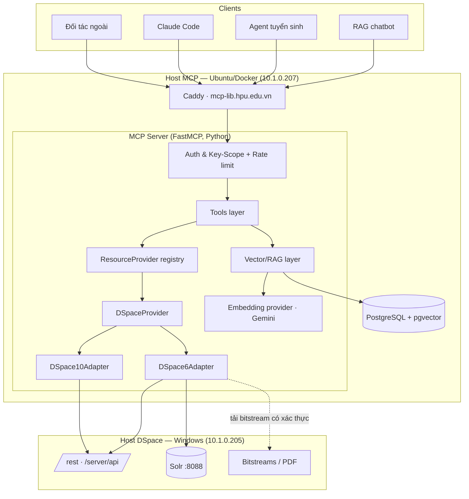
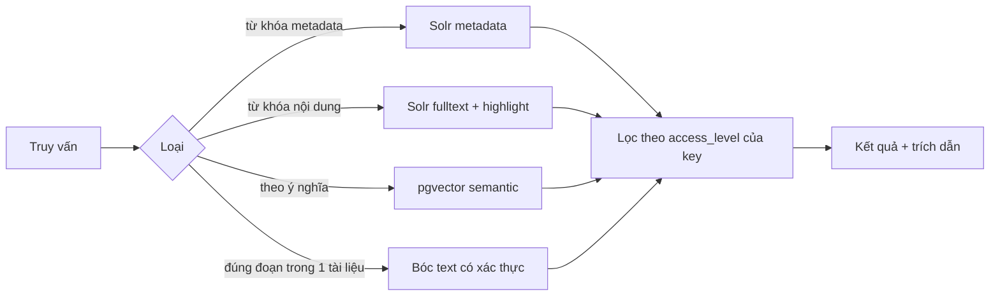
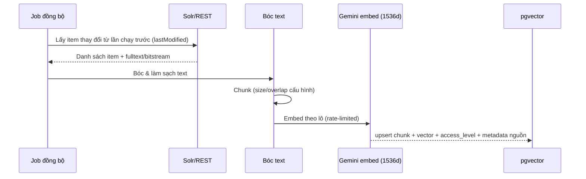

# 02 — Kiến trúc (Architecture)

## 1. Nguyên tắc thiết kế

1. **Cổng duy nhất**: mọi client (nội bộ & ngoài) chỉ nói chuyện với MCP; MCP mới chạm Solr/REST/DB.
2. **Tách nguồn khỏi tool**: tool gọi tầng `ResourceProvider` trừu tượng, không gọi thẳng DSpace.
3. **Tách phiên bản khỏi nguồn**: `DSpaceProvider` chọn adapter `6.3`/`v10` bằng config.
4. **Tầng vector tháo lắp được**: embedding/rerank/chunking sau interface riêng để nâng RAG sau.
5. **Phân quyền là bất biến**: lọc theo mức truy cập của key ở *mọi* đường ra dữ liệu.

## 2. Sơ đồ thành phần



## 3. Deployment topology

| Thành phần | Vị trí | Ghi chú |
|---|---|---|
| Caddy | Host MCP `10.1.0.207` | TLS `mcp-lib.hpu.edu.vn` → `27.72.202.13` |
| MCP Server (container) | Host MCP | FastMCP, Streamable HTTP (prod) + stdio (dev) |
| PostgreSQL + pgvector | Host MCP (container) | Kho chunk + embedding + nhãn access_level |
| Solr `:8088`, REST | Host DSpace `10.1.0.205` | MCP gọi qua LAN, không qua public |
| Bitstream/PDF | Host DSpace | Tải qua REST bằng service account (Tầng 2) |

MCP → Solr/REST đi bằng **IP LAN nội bộ**. Không phụ thuộc URL public `lib.hpu.edu.vn`
(vốn đang được anh Trung siết ở Traefik).

## 4. Các tầng trừu tượng

### 4.1 ResourceProvider (interface)
```
search(query, filters, scope, facets, page)      -> SearchResult
search_content(query, filters, page)             -> SearchResult (có highlight)
semantic_search(query, k, filters)               -> [Chunk]      # qua Vector layer
get(id)                                          -> Resource
get_text(id, page=None)                          -> DocumentText # có xác thực
list_collections() / list_communities()          -> [Node]
stats()                                          -> Stats
health()                                         -> Health
```
- `DSpaceProvider` hiện thực interface, ủy quyền cho adapter phiên bản.
- Thêm nguồn mới (vd `PolicyDocsProvider`) = viết 1 class theo interface + đăng ký registry.

### 4.2 Adapter theo phiên bản
| | DSpace6Adapter | DSpace10Adapter |
|---|---|---|
| Metadata/bitstream | REST cũ `/rest` (header token `rest-dspace-token`) | REST mới `/server/api` (JWT) |
| Search | Solr `search` core trực tiếp | `/server/api/discover/search/objects` (hoặc Solr) |
| Auth | `POST /rest/login` | `POST /server/api/authn/login` (JWT) |
| Trạng thái | Hiện tại | Bật khi lên v10, chọn bằng `DSPACE_VERSION` |

> Chiến lược: REST 6.3 làm **mỏng vừa đủ** (metadata + tải bitstream). Search dồn vào
> Solr; giá trị sâu dồn vào tầng ngữ nghĩa. Tránh đầu tư vào cái sắp thay.

### 4.3 Tầng Vector/RAG (tháo lắp được)
```
EmbeddingProvider.embed(texts) -> [vector]     # mặc định GeminiEmbedding (1536d)
Chunker.split(document)        -> [chunk]       # cấu hình size/overlap
VectorStore(pgvector)          -> upsert/query  # lọc theo access_level
(Reranker)                     -> tùy chọn, cắm sau để nâng RAG
```
Đổi embedding hay thêm reranker chỉ là thay hiện thực interface — đúng ý anh Trung
"dùng Gemini trước, nâng RAG sau".

## 5. Ba tầng tìm kiếm nội dung



- **Tầng 1** cần Solr đã index full-text (verify Sprint 0). Rẻ, nhanh, có ngay.
- **Tầng 2** dùng service account tải bitstream hạn chế, bóc bằng Tika/pdfplumber.
- **Tầng 3** là trọng tâm: pipeline embed → pgvector, đồng bộ tăng dần theo `lastModified`.

## 6. Pipeline ingest cho Tầng 3 (batch, có điều tiết)



Idempotent theo `item_id + chunk_index`; xóa/ẩn item → gỡ chunk tương ứng.

## 7. Lộ trình tiến hóa RAG (ghi nhận, làm sau)
- **Hybrid search**: kết hợp điểm Solr (BM25) + vector rồi hợp nhất.
- **Reranker** cắm vào interface sẵn có.
- **Chunking thông minh** theo cấu trúc tài liệu (mục lục, chương).
- Đổi/song song nhiều embedding model để A/B.
